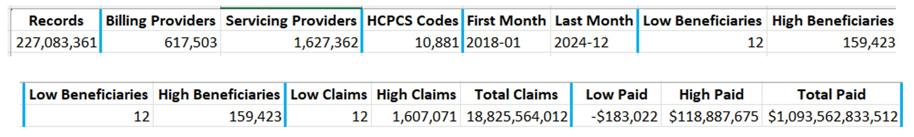
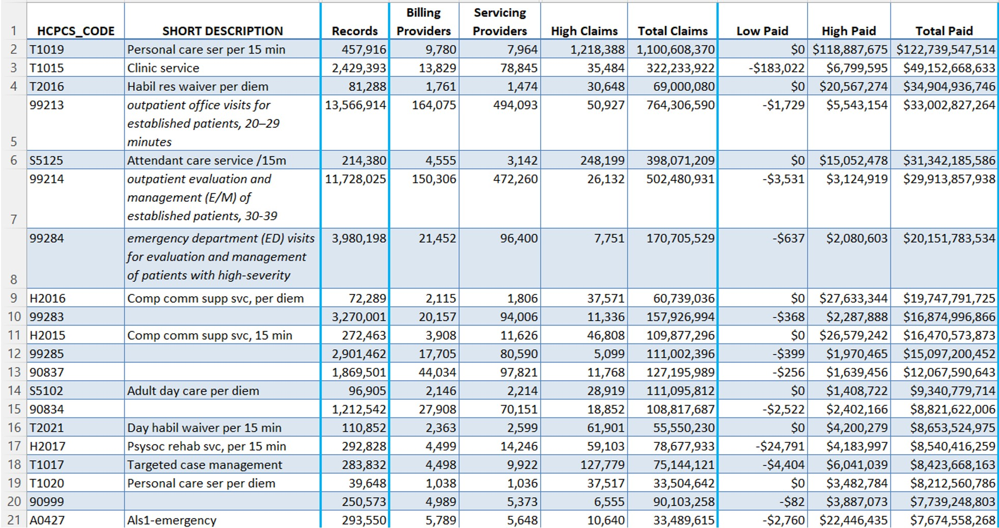
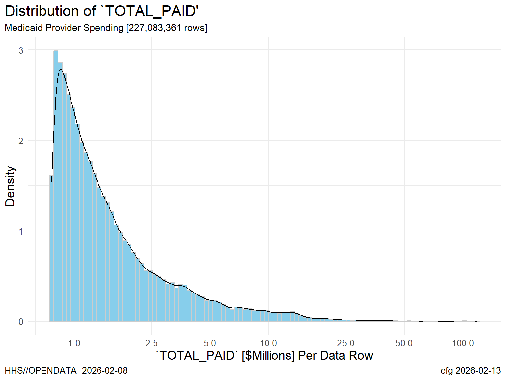

# HHS//OPENDATA Medicaid Provider Spending

On [Feb. 13, 2026 DOGE HHS announced HHS//OPENDATA](https://x.com/DOGE_HHS/status/2022370909211021376) with the first available download.

[This page describes the `Medicaid Provider Spending` download file](https://opendata.hhs.gov/datasets/medicaid-provider-spending/), which is a 3.35 GB ZIP file that expands to a 10.3 GB CSV file.

Here's the online description from HHS.gov:

> This dataset contains provider-level Medicaid spending data aggregated from outpatient and professional claims with valid HCPCS codes, covering January 2018 through December 2024. It provides insights into how Medicaid dollars are distributed across providers and procedures nationwide.

The RStudio notebook in this repository shows how to read the CSV file and extract some "first look" statistics.

# Overall Stats

The file has 227,083,361 spending records from 18,825,564,012 claims that total over $1 trillion from 617,503 billing providers from 1,627,362 servicing providers.

# Stats by HCPCS Code

These stats can be broken down by HCPCS code, but descriptions were not available for some of the codes from what I found online.

Here are the "top 20" HCPCS codes with descriptions.

THe descriptions in italics were found using Google searches.

# `Total Paid` Distribution

A density plot `Total Paid` for the 227,083,361 records is shown below.

Each line in the file typically represents about $1 million in spending, but at least one line was as much as $118 million.

# Next Step

The records in the Medicaid Provider Spending file can be connected to address information through the National Provider Identifier (NPI).

A newer "version 2" of the ["Monthly NPPES Downloadable File Version 2" file is available here](https://download.cms.gov/nppes/NPI_Files.html).

Both the older version 1 and the newer version 2 files are poorly constructed each having 50 mostly-empty repeating groups.

I need to update this [very old repository](https://github.com/EarlGlynn/National-Provider-Identifier) that explained the bloated nature of the NPI files in 2014!

